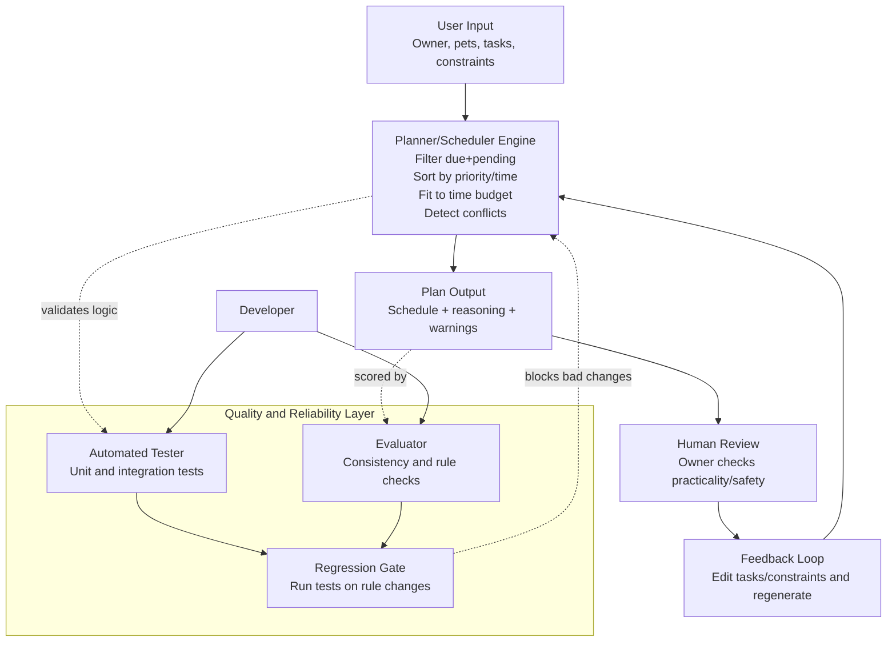

# PawPal+ System Diagram (Mermaid)

This diagram emphasizes the current PawPal+ reliability-oriented architecture.

## Notes

- Core architecture is deterministic scheduling rather than LLM generation.
- Human and automated checks both exist to increase trust in schedule quality.
